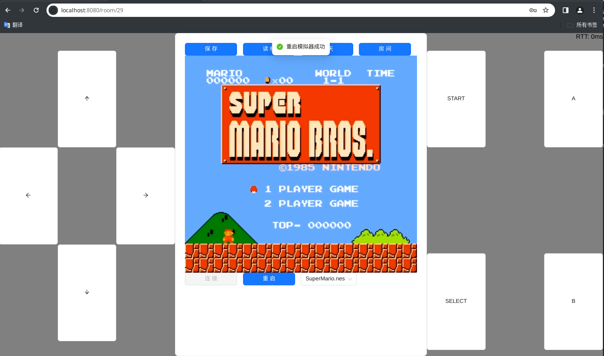

## NESGO
基于WebRTC的云NES模拟器，支持最多4人同屏联机游玩（2玩家+2观战）。

一次部署多端运行，可在PC端和移动端浏览器运行。

### 功能列表

- [x] 多人游戏房间，房主可设置权限。
- [x] 模拟器热重启，重启模拟器不需要断开游戏连接。
- [x] 保存与读取，跨游戏加载存档自动重启模拟器
- [x] 房间内即时聊天
- [ ] 存档转移（跨房间转移、上传下载）
- [ ] 游戏上传下载

## Issues

- 暂不支持部分卡带格式
- 部分游戏存在贴图渲染错误

## 安装部署

### 编译运行

安装依赖

```shell
apt install pkg-config libx264-dev libopusfile-dev
```

编译前后端

```shell
# 编译前端文件
cd ui && yarn build
# 编译后端和模拟器
go mod tidy
go build -tags="web" -o nesgo_web
```

创建配置文件config.yml： 

```yaml
#数据库URL
db_url: "root:12345678@tcp(127.0.0.1:3306)/nesgo?charset=utf8mb4&parseTime=True&loc=Local"
#redis地址
redis_addr: "0.0.0.0:6379"
#存档保存方式（暂时只支持宿主机文件系统）
file_storage_type: "host"
#存档保存路径
host_fs_store_dir: "/var/lib/nesgo/saves"
#WebRTC TURN服务器配置
turn_server:
  addr: "turn:127.0.0.1:3478"
  long_term_user: "test"
  long_term_password: "123456"
```

运行

```shell
# -dir 指定游戏文件所在的目录
./nesgo_web -dir $HOME/games
```

## 截图

.PNG)

.PNG)


